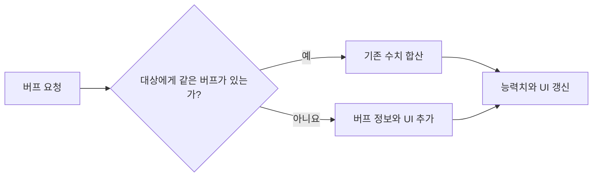

# InEarth3

Unity와 C#으로 제작한 카드·덱 기반 전투 프로젝트의 스크립트 보존 저장소입니다.
이 저장소는 2022년에 정리한 당시 코드의 스냅숏이며, 전체 Unity 프로젝트와 게임 리소스는 포함하지 않습니다.

## 프로젝트 개요

| 구분 | 내용 |
| --- | --- |
| 개발 형태 | 팀 프로젝트 |
| 사용 기술 | Unity, C# |
| 주요 영역 | 카드·덱, 플레이어·몬스터 스킬, 버프와 전투 상태 |
| 저장소 상태 | 당시 작성한 스크립트를 보존한 코드 자료 |

## 담당 및 기여 범위

- 카드와 덱, 플레이어·몬스터 스킬 관련 기능 개발
- 버프 종류별 배열을 확장하는 방식 대신 비트 플래그 기반 상태 관리 방식 제안 및 구현
- 버프의 존재 여부와 실제 수치·UI 정보를 분리하여 관리
- 스킬의 비용·대상·효과·아이콘·사운드를 `ScriptableObject` 데이터로 구성

## 핵심 구현

### 1. 비트 플래그 기반 버프 상태 관리

플레이어·골렘·몬스터의 버프 존재 여부를 대상별 정수값에 기록합니다. 비트 연산으로 버프를 활성화·확인·해제하고, 실제 수치와 UI 참조는 별도 목록에서 관리합니다.

관련 코드:

- [MapManager.cs](./MapManager.cs): `setBuffStateGab`, `removeBuffStateGab`, `getBuffStateGab`, `getBuffNewVersion`

### 2. 스킬 데이터 구성

스킬의 이름, 등급, 대상, 비용·피해·반복 횟수, 효과 위치, 아이콘과 사운드를 `SkillBlock` 자산으로 구성했습니다. 스킬마다 달라지는 값을 Unity 에디터에서 설정할 수 있습니다.

관련 코드:

- [SkillBlock.cs](./scriptable/SkillBlock.cs)
- [EffectData.cs](./scriptable/EffectData.cs)
- [MonsterSkill.cs](./scriptable/MonsterSkill.cs)

### 3. 카드·덱 전투 흐름

보유 덱에서 전투용 카드를 구성하고, 카드 비용과 스킬 이벤트를 연결하며, 사용 전·사용 후 카드 목록을 관리합니다.

관련 코드:

- [MapManager.cs](./MapManager.cs): 카드 획득·사용 및 전투 상태
- [GameManager.cs](./GameManager.cs): 덱 데이터와 진행 상태

## 코드 안내 문서

- [핵심 코드 흐름](./docs/CODE_WALKTHROUGH.md)
- [현재 관점의 회고와 개선 방향](./docs/RETROSPECTIVE.md)

## 저장소 제한사항

- 전체 Unity 프로젝트가 아니므로 이 저장소만으로 게임을 실행할 수 없습니다.
- 원본 씬, 프리팹, 사운드와 이미지 등 일부 리소스가 포함되어 있지 않습니다.
- 메모리나 처리 속도의 정량적인 개선 결과는 측정하지 않았으므로 성능 수치를 주장하지 않습니다.
- 당시 학습·개발 과정의 코드를 보존한 자료이므로 현재의 코드 작성 기준과 차이가 있습니다.
- 별도 라이선스를 제공하지 않으며, 공개 저장소는 오픈소스 사용 허가를 의미하지 않습니다.
